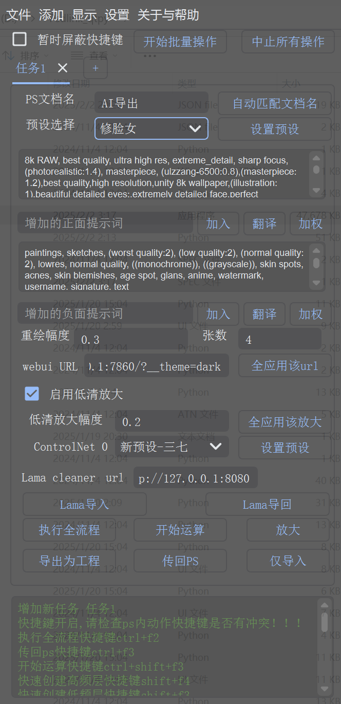
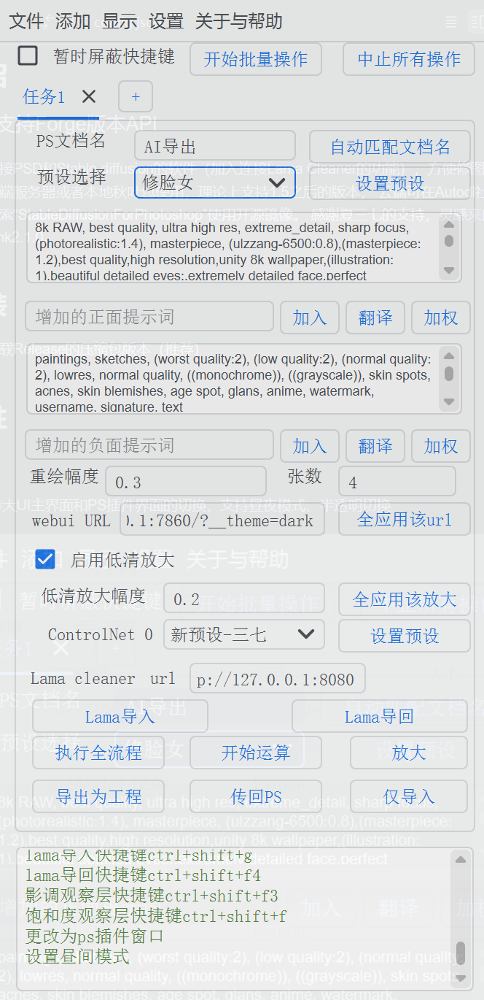
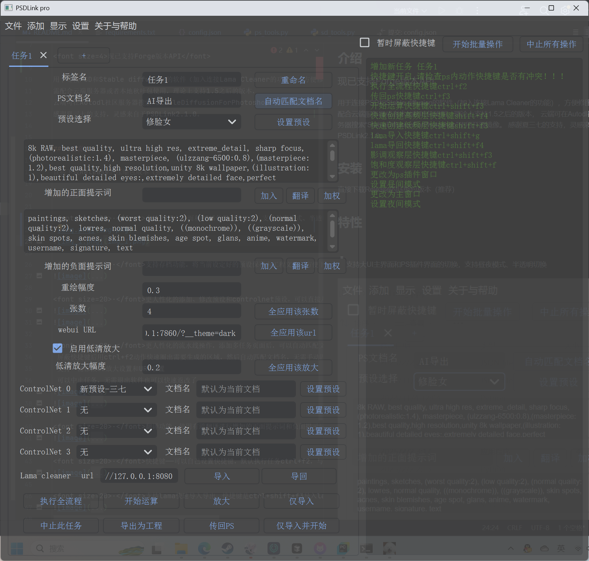
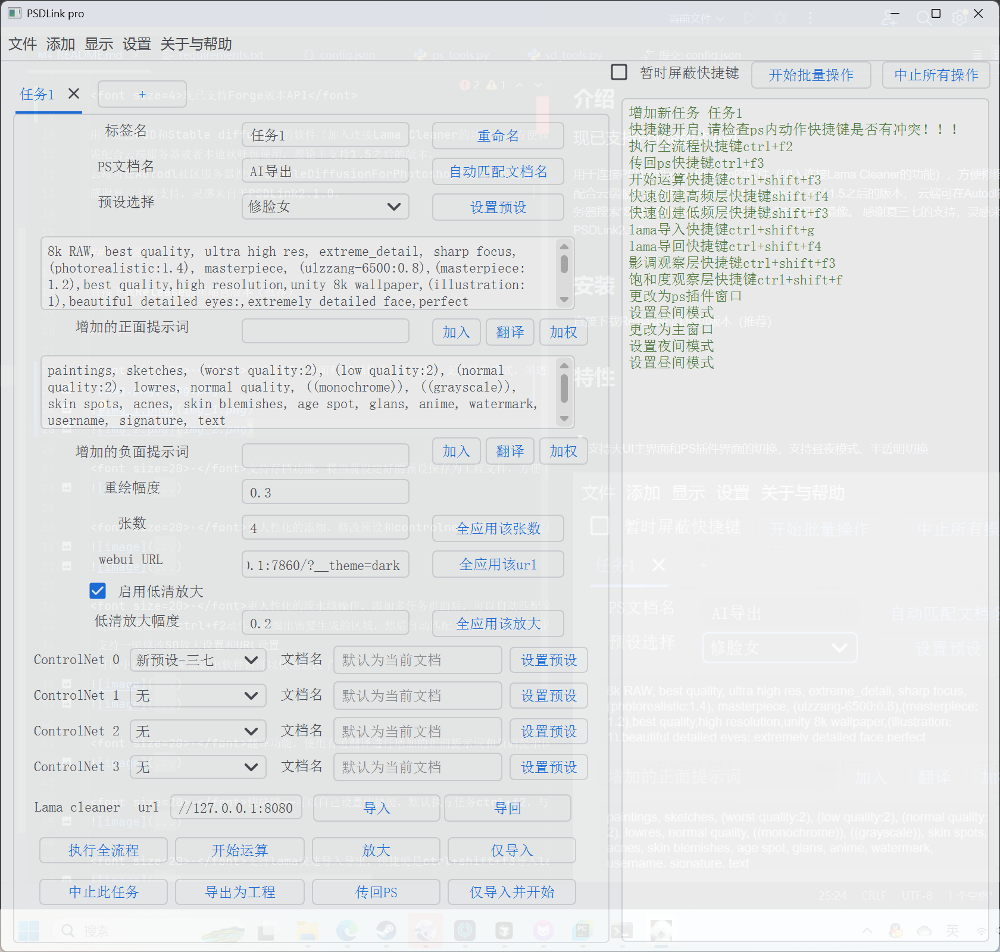

# PSDLinkStableDiffusion
用于连接PSD和Stable diffusion的软件

## 介绍

现已支持Forge版本API

用于连接PSD和Stable diffusion的软件（加入连接Lama Cleaner的功能），方便修图，
需配合云端服务器或者本地秋叶包使用，理论上支持1.5之后的版本，
云端可在Autodl社区服务器搜索“StableDiffusionForPhotoshop”使用开源镜像。
感谢夏三七的支持，灵感来自于PSDLink2.1.0。

##  安装

直接下载Release的压缩包版本（推荐）

## 特性

·支持大UI主界面和PS插件界面的切换，支持昼夜模式、半透明切换

·支持存档功能，将当前设定好的预设保存为工程文件，方便下次使用，或者分享给他人使用

·更人性化的添加、修改预设和controlnet预设，可以直接从stable diffusion页面读取信息

·更人性化的流水线操作，添加多任务页面后，可以自动匹配文档名（需要配合Release包中的动作使用）
 屏蔽快捷键后用ctrl+f2动作快速圈出需要生成的区域，然后自动匹配文档名，无需手动匹配
 支持一键修改SD放大设置和URL设置
 可以中止任务，无需退出软件也可以快速返改了

·翻译功能，使用有道翻译进行增加的正面提示词和负面提示词翻译

·快捷键——可以自己设置快捷键，默认执行任务ctrl+f2，与动作配合

·支持lama快速导入导出，快捷键是ctrl+shift+f3导入lama，ctrl+shift+f4导回PS

·长任务完成后可自定义是否需要播放音频提醒

